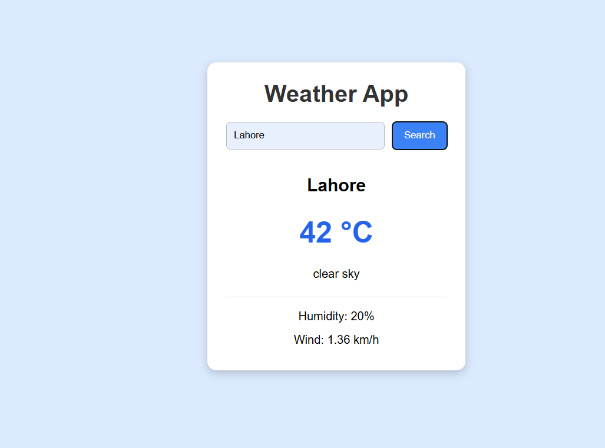

# Weather App

A simple weather application built using HTML, CSS, and JavaScript. It allows users to search for any city and view the current weather information using the OpenWeatherMap API.

## Features

- Search weather by city name
- Display current temperature
- Show weather description
- Display humidity
- Show wind speed
- Basic error handling for invalid city names
- Responsive and clean user interface

## Technologies Used

- HTML
- CSS
- JavaScript (ES6)
- OpenWeatherMap API

## Author

Abu Bakar Baig
